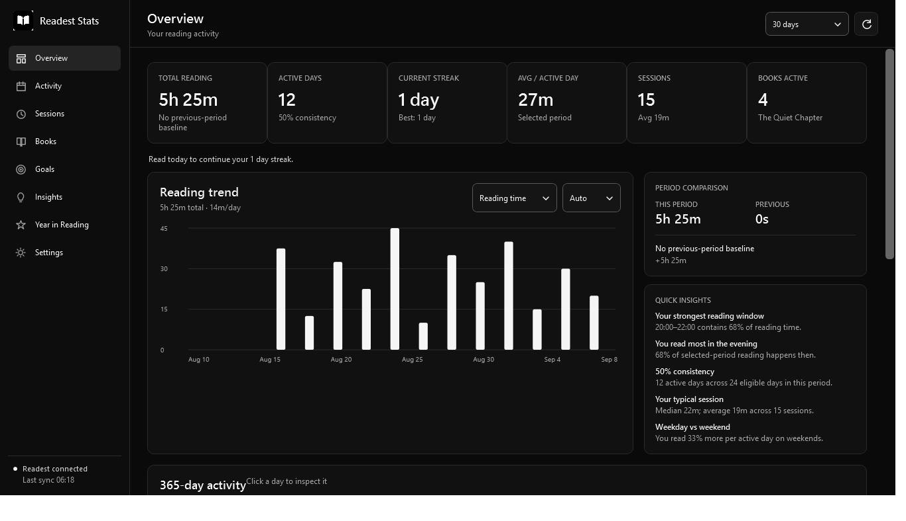
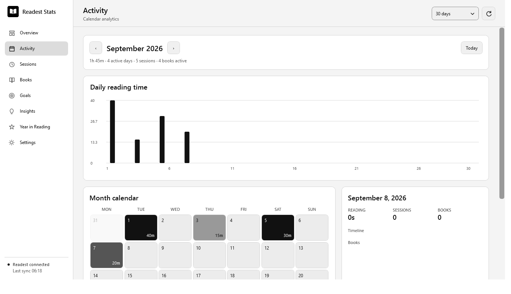
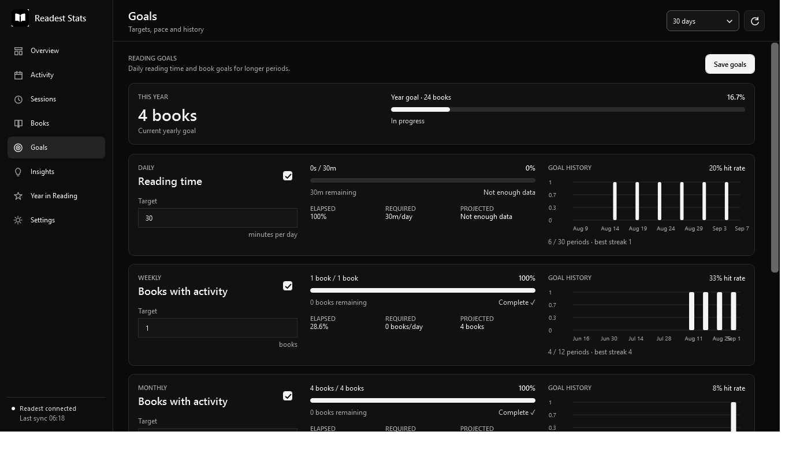
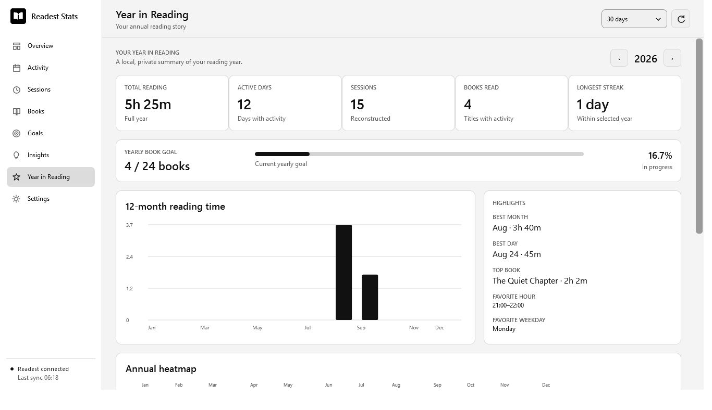

# Readest Stats 1.1.0

[](https://github.com/phunguyen1006/statistics_readest/releases/tag/v1.1.0)
[](https://github.com/phunguyen1006/statistics_readest/releases/latest)
[](LICENSE)

Readest Stats is an independent native Windows desktop viewer for the reading statistics stored locally by Readest. Version 1.1.0 adds a monochrome analytics workspace with complete dark, light, and system themes across Overview, Activity, Sessions, Books, Goals, Insights, Year in Reading, and Settings.

Highlights include global date ranges and fair elapsed-period comparisons, daily/weekly/monthly trend aggregation, a clickable 365-day heatmap, a full month calendar, active-versus-elapsed session analysis, book-level patterns, deterministic insights, a daily reading-time target, weekly/monthly/yearly book targets, yearly progress, and automatic archives for past years.

## Screenshots

### Overview — dark mode



### Activity — light mode



### Goals and Year in Reading

| Goals — dark mode | Year in Reading — light mode |
| --- | --- |
|  |  |

## Download

Download `ReadestStats.exe` from the [latest GitHub release](https://github.com/phunguyen1006/statistics_readest/releases/latest). The application is self-contained for Windows x64 and does not require a separate .NET runtime.

## Data safety

The Readest database is opened with SQLite `ReadOnly` mode and a connection-local `query_only` guard. The application contains no generic write API for the source database. Settings and goals are stored separately in `%LOCALAPPDATA%\ReadestStats\`.

The default data location is:

`%APPDATA%\com.bilingify.readest\Readest\statistics.db`

Readest Stats also checks Readest's `customRootDir` setting and allows selecting `statistics.db` manually.

Page numbers and total-page values can change with pagination, font size, layout, or reading-engine behavior. Therefore page-based progress, completion, and “books finished” are not used as trustworthy primary metrics. The experimental page-metrics option is off by default.

## Refresh and local state

Refresh can be manual, triggered by Readest database changes, or run on a 30-second, 1-minute, or 5-minute interval. Refreshing happens in the background and preserves the last good dataset if the source is briefly busy or unavailable. Goals and settings can be backed up as JSON and survive upgrades through schema migration.

## Build

Run from PowerShell:

```powershell
.\build-release.ps1
```

The script runs all automated tests and publishes a self-contained single-file Windows x64 application.

## Release

The executable is written to:

`artifacts\win-x64\ReadestStats.exe`

Double-click it; no browser, server, Node.js, or separately installed .NET runtime is required.

## Troubleshooting

- If the database is not found, open Settings and choose **Change database**.
- If Readest is actively writing, Readest Stats retries brief SQLite busy/locked errors automatically.
- If a custom root changed, use **Re-detect**.
- If the selected file is incompatible, the app reports the schema problem without modifying it.

## License

Released under the [MIT License](LICENSE).
